# TalkLoop

Connect. Chat. Stay Anonymous.

TalkLoop is a real-time anonymous chat application built with Flutter and Node.js. It lets users create an anonymous identity, get matched with strangers, and chat in real time without revealing their account identity to the person on the other end.

## Screenshots

| Splash Screen | Create Account | Profile Setup |
|---|---|---|
| 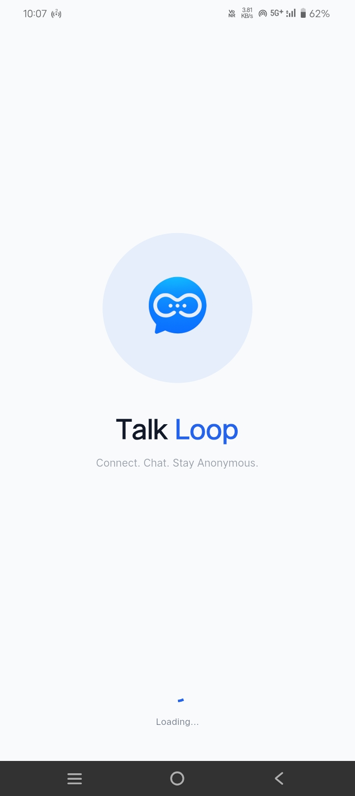 | 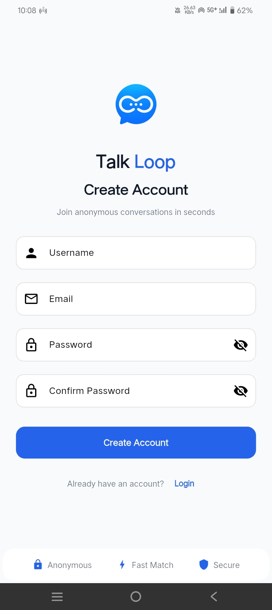 | 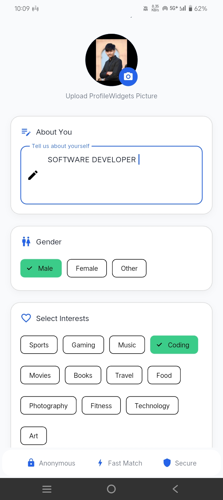 |

| Anonymous Identity | Home | User Profile |
|---|---|---|
| 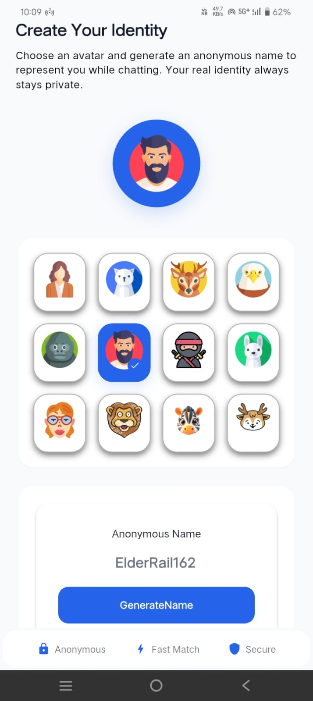 | 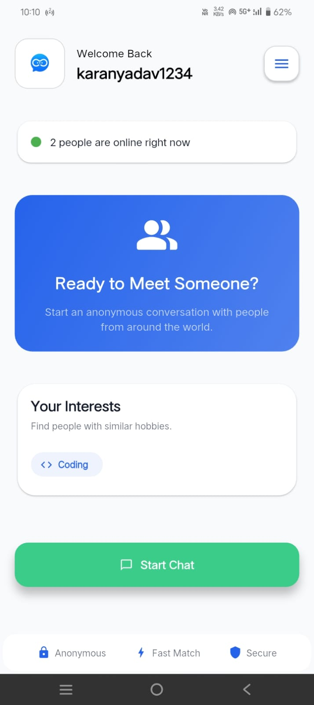 | 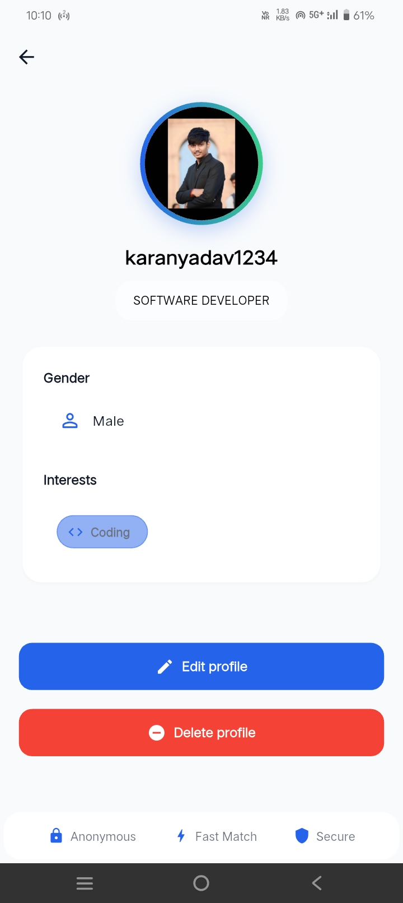 |

| Searching for a Stranger | Real-Time Chat | Report User |
|---|---|---|
| 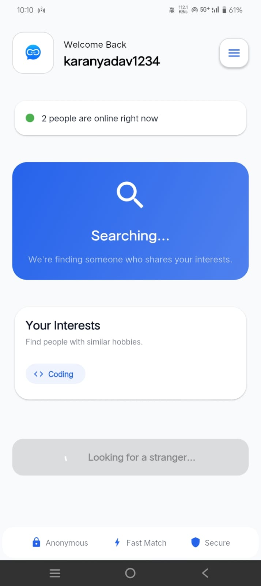 |  | 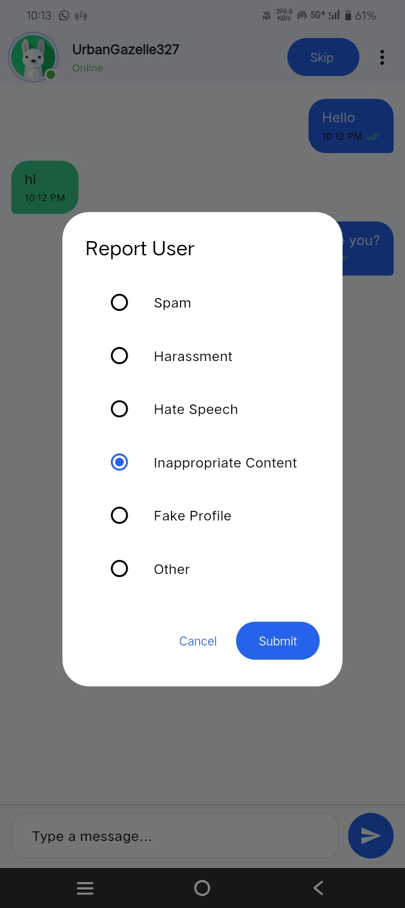 |

| Settings | Appearance | About TalkLoop |
|---|---|---|
| 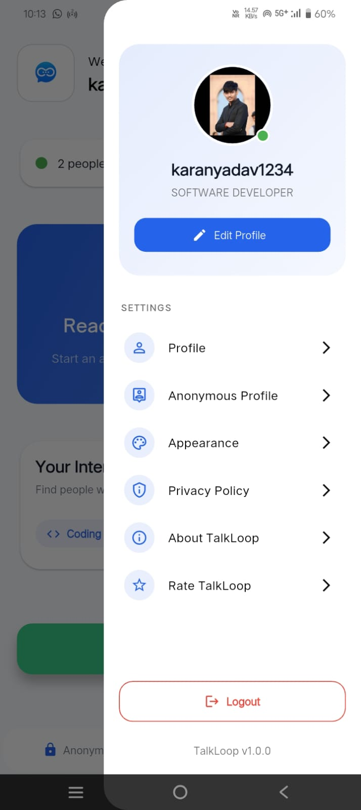 | 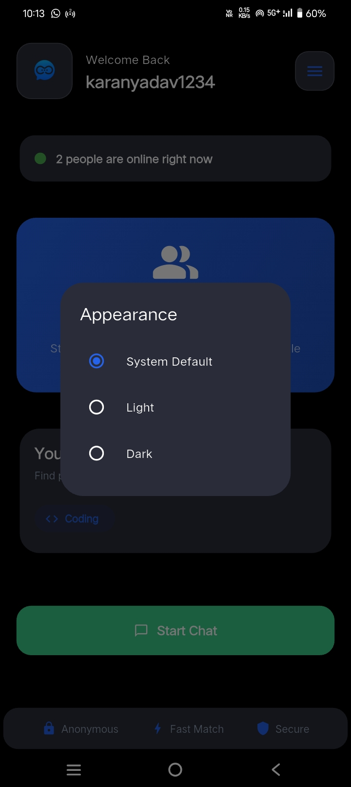 | 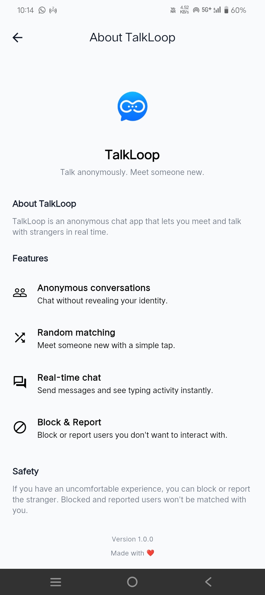 |

| Privacy Policy | Rate TalkLoop |
|---|---|
| 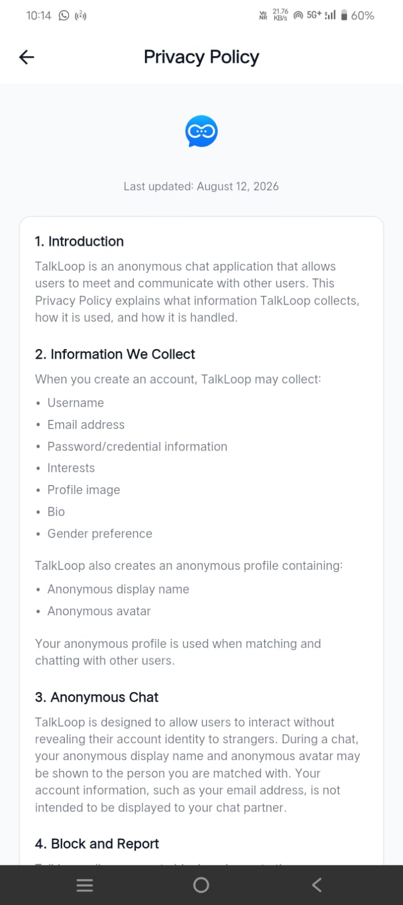 |  |

## Features

- Anonymous stranger conversations
- Random stranger matching
- Interest-based matching
- Real-time messaging with Socket.IO
- Real-time typing indicator
- Anonymous display name and avatar
- Anonymous profile management
- User profile management
- Block users
- Report users
- Blocked and reported users are excluded from matching
- Skip or end a chat at any time
- Automatic handling when a stranger disconnects
- Network and disconnection handling
- Online user count
- Message rate limiting
- Stranger matching rate limiting
- Limits on how often profile and anonymous identity can be changed
- Light, dark, and system appearance modes
- Privacy Policy and About screens
- Rate-app screen

## Tech Stack

**Frontend**
- Flutter
- Dart
- Dio
- Socket.IO Client

**Backend**
- Node.js
- Express.js
- Socket.IO
- MongoDB
- Mongoose
- JWT
- bcryptjs
- Multer
- Cloudinary
- Express Rate Limit

**Deployment**
- Render
- MongoDB

## Architecture

```text
                    ┌──────────────────────┐
                    │     Flutter App      │
                    │       Android        │
                    └──────────┬───────────┘
                               │
                    REST API + Socket.IO
                               │
                               ▼
                    ┌──────────────────────┐
                    │    Node.js Server    │
                    │ Express + Socket.IO  │
                    └──────────┬───────────┘
                               │
                               ▼
                    ┌──────────────────────┐
                    │       MongoDB        │
                    │       Mongoose       │
                    └──────────────────────┘
```

## Anonymous Matching

TalkLoop keeps a user's account identity separate from their anonymous chat identity. During a conversation, the stranger only sees the anonymous profile, not the user's account email or other account credentials.

Matching also takes blocking and reporting into account, so users who shouldn't interact with each other are kept out of the same matching pool.

## Real-Time Communication

Socket.IO handles real-time communication between matched users, including:

- Stranger matching
- Room creation
- Message delivery
- Typing and stop-typing events
- Chat termination
- Stranger disconnection
- Reconnection and network-related states

Each active conversation runs in its own Socket.IO room.

## Safety Features

TalkLoop includes some basic safety controls:

- Block, to prevent unwanted interaction with a user
- Report, to flag inappropriate behavior or content
- Matching filters, so blocking and reporting history is considered before a match is made
- Rate limiting, to curb abusive or excessive API and socket activity

## Project Structure

```text
TalkLoop/
│
├── frontend/
│   ├── lib/
│   ├── assets/
│   ├── android/
│   └── pubspec.yaml
│
├── backend/
│   ├── src/
│   │   ├── config/
│   │   ├── controllers/
│   │   ├── middleware/
│   │   ├── models/
│   │   ├── routes/
│   │   └── sockets/
│   ├── package.json
│   └── server.js
│
└── README.md
```

## Running Locally

### 1. Clone the repository

```bash
git clone https://github.com/Shunya-karan/Flutter-Anonymous-Chat-App.git
cd TalkLoop
```

### 2. Backend setup

```bash
cd backend
npm install
```

Create a `.env` file:

```env
PORT=3000
MONGO_URI=your_mongodb_connection_string
JWT_SECRET=your_jwt_secret
```

Add whatever other environment variables your Cloudinary and auth setup needs.

Start the backend:

```bash
npm run dev
```

or:

```bash
node server.js
```

### 3. Flutter setup

Open a new terminal:

```bash
cd frontend
flutter pub get
flutter run
```

To build a release APK:

```bash
flutter build apk --release
```

## Production

The backend is deployed on Render, and the Flutter app talks to the production REST API and Socket.IO server. For local development, point the frontend's API configuration at your local backend instead.

## Privacy

TalkLoop includes an in-app Privacy Policy covering account information, anonymous profiles, anonymous conversations, blocking and reporting, and related data handling.

## Project Status

Completed — production-tested prototype.

The core application flow has been built and tested across Android and web clients, including real-time matching and chat behavior.

## Developer

Karan Yadav

GitHub: [Shunya-karan](https://github.com/Shunya-karan)

LinkedIn: [Karan Yadav](https://www.linkedin.com/in/karan-yadav-7a600431b/)

## License

This project is licensed under the MIT License.
